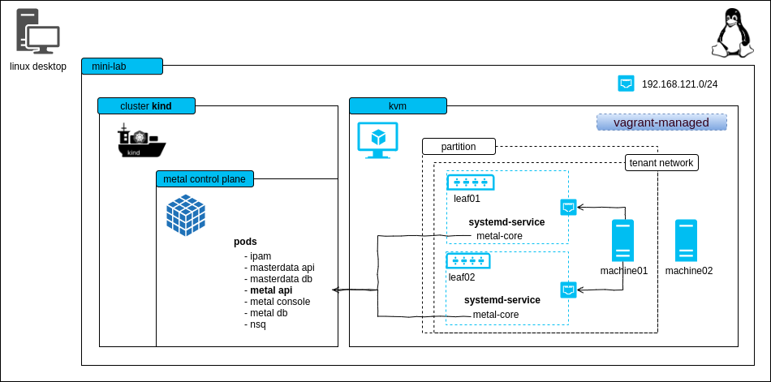

# mini-lab

The mini-lab is a small, virtual setup to locally run the metal-stack. It deploys the metal control plane and a partition with two simulated leaf switches. The lab can be used for trying out metal-stack, demonstration purposes or development.



This project can also be used as a template for writing your own metal-stack deployments.

<!-- TOC depthFrom:2 depthTo:6 withLinks:1 updateOnSave:1 orderedList:0 -->

- [mini-lab](#mini-lab)
  - [Requirements](#requirements)
  - [Known Limitations](#known-limitations)
  - [Try it out](#try-it-out)
    - [Reinstall machine](#reinstall-machine)
    - [Remove machine](#remove-machine)
  - [Development of metal-api, metal-hammer and metal-core](#development-of-metal-api-metal-hammer-and-metal-core)

<!-- /TOC -->

## Requirements

- Linux
- [Vagrant](https://www.vagrantup.com/) == 2.2.9 with vagrant-libvirt plugin >= 0.1.2 (for running the switch and machine VMs)
- kvm as hypervisor for the VMs
- [docker](https://www.docker.com/) >= 18.09 (for using kind and our deployment base image)
- [docker-compose](https://docs.docker.com/compose/) >= 1.25.4 (for ease of use and for parallelizing control plane and partition deployment)
- [kind](https://github.com/kubernetes-sigs/kind/releases) == v0.8.1 (for hosting the metal control plane on a kubernetes cluster v1.18.2)
- [ovmf](https://wiki.ubuntu.com/UEFI/OVMF) to have a uefi firmware for virtual machines
- the lab creates a virtual network 192.168.121.0/24 on your host machine, this hopefully does not overlap with other networks you have
- (recommended) haveged to have enough random entropy (only needed if the PXE process does not work)

Here is some code that should help you setting up most of the requirements:

 ```bash
# Install Docker
curl -fsSL https://get.docker.com | sh
# if you want to be on the safe side, follow the original installation
# instructions at https://docs.docker.com/engine/install/ubuntu/

# Install vagrant and other stuff
wget https://releases.hashicorp.com/vagrant/2.2.9/vagrant_2.2.9_x86_64.deb
sudo apt-get install ./vagrant_2.2.9_x86_64.deb qemu-kvm virt-manager ovmf net-tools libvirt-dev haveged

# Ensure that your user is member of the group "libvirt"
# possibly you need to login again in order to make this change take effect
sudo usermod -G libvirt -a ${USER}

# Install libvirt plugin for vagrant
vagrant plugin install vagrant-libvirt

# Install kind from https://github.com/kubernetes-sigs/kind/releases
```

The following ports are getting used statically:

| Port | Bind Address | Description                        |
|:----:|:------------ |:---------------------------------- |
| 8443 |   0.0.0.0    | kube-apiserver of the kind cluster |
| 4443 |   0.0.0.0    | HTTPS ingress                      |
| 4150 |   0.0.0.0    | nsqd                               |
| 4161 |   0.0.0.0    | nsq-lookupd                        |
| 5222 |   0.0.0.0    | metal-console                      |
| 8080 |   0.0.0.0    | HTTP ingress                       |

## Known Limitations

- to keep the demo small there is no EVPN
- machine restart and destroy does not work because we cannot change the boot order via IPMI in the lab easily (virtual-bmc could, but it's buggy)
- login to the machines is only possible with virsh console

## Try it out

Start the mini-lab with a kind cluster, a metal-api instance as well as some vagrant VMs with two leaf switches and two machine skeletons.

```bash
make
```

Two machines in status `PXE booting` are visible with `metalctl machine ls`

```bash
docker-compose run metalctl machine ls

ID                                          LAST EVENT   WHEN     AGE  HOSTNAME  PROJECT  SIZE          IMAGE  PARTITION
e0ab02d2-27cd-5a5e-8efc-080ba80cf258        PXE Booting  3s
2294c949-88f6-5390-8154-fa53d93a3313        PXE Booting  5s
```

Wait until the machines reach the waiting state

```bash
docker-compose run metalctl machine ls

ID                                          LAST EVENT   WHEN     AGE  HOSTNAME  PROJECT  SIZE          IMAGE  PARTITION
e0ab02d2-27cd-5a5e-8efc-080ba80cf258        Waiting      8s                               v1-small-x86         vagrant
2294c949-88f6-5390-8154-fa53d93a3313        Waiting      8s                               v1-small-x86         vagrant
```

Create a machine with

```bash
make machine
```

or the hard way with

```bash
docker-compose run metalctl network allocate \
        --partition vagrant \
        --project 00000000-0000-0000-0000-000000000000 \
        --name vagrant
```

Lookup the network ID and run

```bash
docker-compose run metalctl machine create \
        --description test \
        --name machine \
        --hostname machine \
        --project 00000000-0000-0000-0000-000000000000 \
        --partition vagrant \
        --image ubuntu-19.10 \
        --size v1-small-x86 \
        --networks <network-ID>
```

See the installation process in action

```bash
virsh console metal_machine01/02
...
Ubuntu 19.10 machine ttyS0

machine login:
```

One machine is now installed and has status "Phoned Home"

```bash
docker-compose run metalctl machine ls
ID                                          LAST EVENT   WHEN   AGE     HOSTNAME  PROJECT                               SIZE          IMAGE         PARTITION
e0ab02d2-27cd-5a5e-8efc-080ba80cf258        Phoned Home  2s     21s     machine   00000000-0000-0000-0000-000000000000  v1-small-x86  Ubuntu 19.10  vagrant
2294c949-88f6-5390-8154-fa53d93a3313        Waiting      8s                                                             v1-small-x86                vagrant
```

Login with user name metal and the console password from

```bash
docker-compose run metalctl machine describe e0ab02d2-27cd-5a5e-8efc-080ba80cf258 | grep password

consolepassword: ...
```

To remove the kind cluster and the vagrant boxes, run

```bash
make cleanup
```

### Reinstall machine

Reinstall a machine with

```bash
docker-compose run metalctl machine reinstall \
        --image ubuntu-19.10 \
        e0ab02d2-27cd-5a5e-8efc-080ba80cf258
```

### Remove machine

Remove a machine with

```bash
docker-compose run metalctl machine rm e0ab02d2-27cd-5a5e-8efc-080ba80cf258
```

## Development of metal-api, metal-hammer and metal-core

To simplify developing changes for the `metal-api`, `metal-hammer` and `metal-core`, it is possible to use development artifacts from within the mini-lab.
See the [dev instructions](DEV_INSTRUCTIONS.md) for more details.
